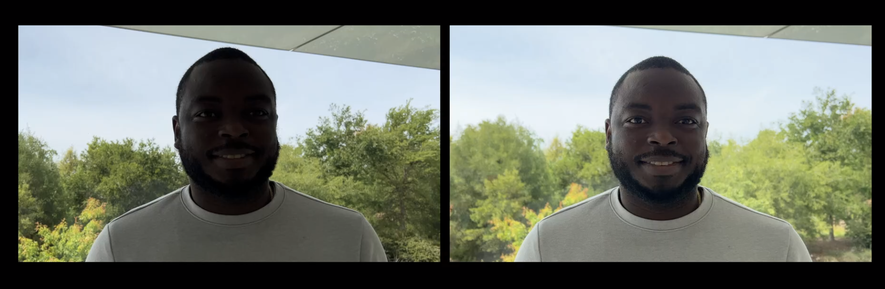
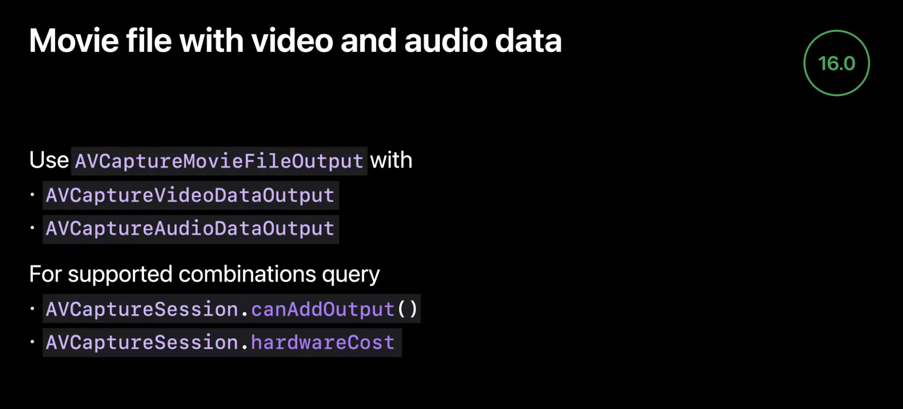

# Discover advancements in iOS camera capture: Depth, focus, and multitasking

### LiDAR Scanners
* iPhone 12Pro, iPhone 13Pro, iPad Pro(5th)에서 가능 (starting - iOS 15.4)

* 주변환경에 빛을 쏘고 반사된데 걸리는 시간의 차를 이용해 depth 계산
* 초당 수백만번 수행
* 예제에서는 RealityKit을 사용하여 가상의 spotlight 구현

* ARKit (in iPadOS 13.4)에서 최초 소개 -> iOS15.4에서 AVFoundation을 통해 LiDAR Scanner를 직접 접근할수 있도록 함
  * High-quality, High-Accuracy depth information
* 후면 광각카메라(wide-angle camera)를 사용하여 LiDAR scanner로 영상을 전송 -> Depth 정보 Capture! (with 머신러닝)
  * Video & Depth captured in wide-angle (광각카메라의 시야에 맞는 형태로 제공)
* TrueDepth AVCaptureDevice와 마찬가지로 모든 포맷 지원 (16, 32)
* LiDAR가 wide-angle 카메라를 사용하기 때문에 AVCaptureMultiCamSession을 이용해 ultra-wide-angle 카메라, Telephoto의 사용이 가능
* LiDAR resolution

* 장치 유형에 따른 DepthData
  * DualCamera - wide + telephoto
  * DualWideCamera - wide + ultra wide
  * TrippleCamera - telephoto + wide + ultra wide
    * Relative, disparity-base depth
    * 전력 소모량이 적고 사진 효과를 렌더링 하는 앱에 적합
  * LiDARDepthCamera - wide + lidar
    * Alsolute depth, Real-world scale

* AVDepthData
  * AVFoundation이 제공하는 depth정보 class (type정보, accuracy정보 포함)
  * filtering 기술이란 noise 제거, hole 메꾸기 등의 data 보정이라고 보면됨
  * computer vision 앱의 경우 non filtered data가 유리 (depthMap의 original값을 보존해야하기때문)

* ARKit vs AVFoundation
  * ARKit은 이름에서 알 수 있듯이 증강현실을 위함 (AR algorithms)
  * AVFoundation은 video & photography app에 적합
  * ARKit에서 얻을수 있는 DepthMap과 AVFoundation에서 얻을수 있는 DepthMap의 해상도도 다름 (256*192) vs 최대(768*576)
  * 결론) 목적이 다르다

### Face-driven AF/AE

* Auto Focus and AutoExposure system
  * Auto focus 시스템은 피사체의 초점을 자동으로 맞추고, Auto exposure 시스템은 피사체가 계속 보이도록 가장 밝은 부분과 어두운 부분의 균형을 맞춘다
  * 그러나 가끔 피사체의 얼굴이 제대로 focus되지않거나 exposure가 제대로 맞춰지지 않을때가 있다

 
* Prioritize faces

### Advanced streaming

* CustomEffect(like filters) recording app

 
* iOS 16, iPadOS 16 AVCaptureVideoDataOutput을 동시에 여러개 사용가능
  * Preview / Record
 

  * Video stabilization

  * Configuring video resolution

 
  * More

  * MovieFile with video and audio data 
    * 녹화와 동시에 비디오 데이터, 오디오 데이터를 한번에 받을 수 있다. 
    * 과연 송출과 녹화를 동시에 진행할수있을까?

### Multitasking camera access

* iPad multitasking
  * 기존에는 여러 이유 (연산이 많은 상황에서의 Camera frame드랍등의 이유)로 막았지만 이제 Camera 경험을 최우선으로 하겠다
  * 경고를 띄우는 것으로 최소한의 장치를 마련 (녹화화는 기능을 사용하는 동안, 모든 앱을 통틀어 한번만 노출)
  * ARKit은 미지원
  * 지속적인 확인을 통해 원할하게 만드는것은 개발자의 몫 (시스템 상황에 따라 frameRate를 낮춘다던가 등)

