# Capture machine-readable codes and text with VisionKit

### Data scanning (before iOS16)
- LiveText(introduced in iOS15)
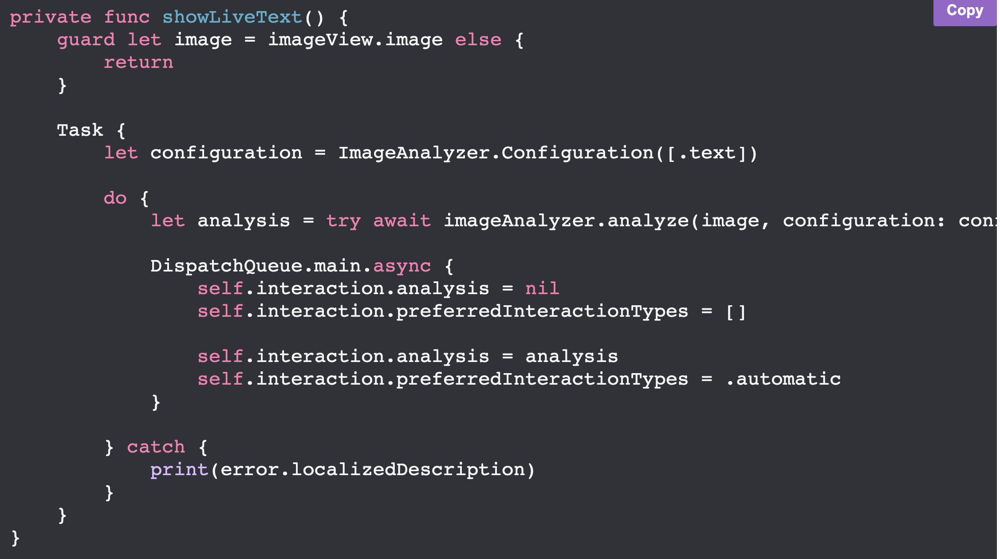

- AVFoundation framework
  - AVCaptureMetadataOutput 연결
  - Get AVMetadataObject
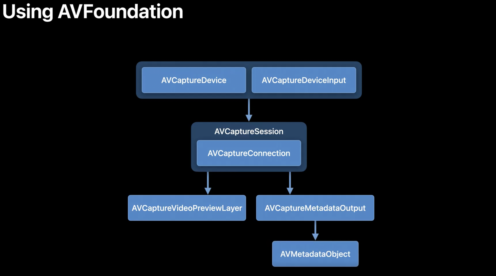

- AVFoundation + Vision
  - AVCaptureVideoDataOutput 연결
  - CMSampleBufferRef에서 필요한 정보 추출
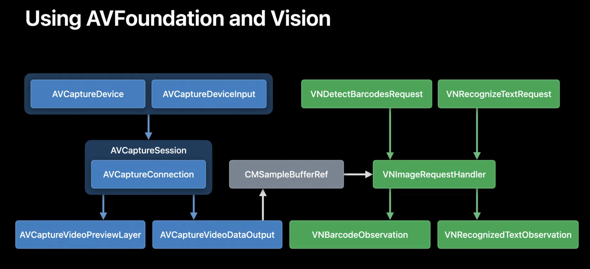

### DataScannerViewController (in iOS16)
- 간단한 scanner 개발을 용이하도록 캡슐화
  - 기존에는 위의 내용을 직접 개발해야 했었음 
- Apple Neural Engine사용이 가능한 디바이스만 가능
- CameraPreview, 가이드, 하이라이트, Focus, Pinch

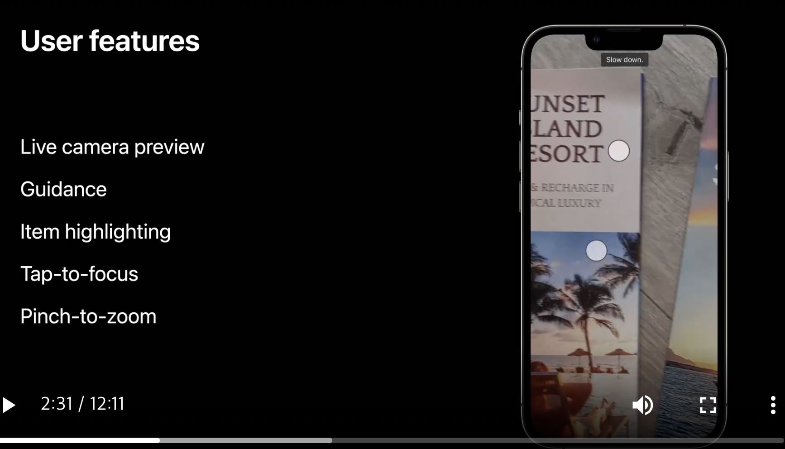
 
 #### Developer features
 - `UIViewController` subclass
 - View 좌표계 사용
 - 관심영역 지정 가능 (View 좌표계)
 - 텍스트 타입 지정 (언어 지정도 가능)
 - Machine-readable code도 형태지정 (ex - QRcode ..)
 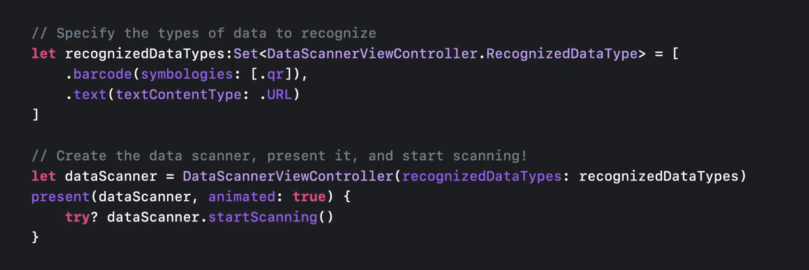
 
 
 
- 지원 가능 코드

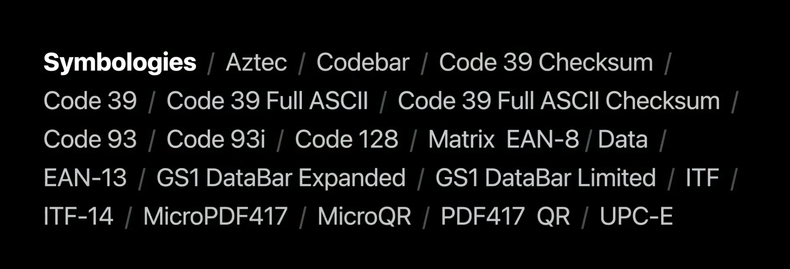

- 지원 가능 언어
  - 다만, 나중에 변할수도 있다 (왠지 밑밥..)

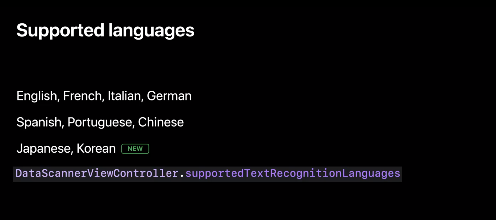
 
 - 텍스트 유형 지정
 
 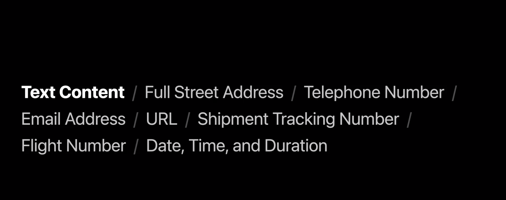
 
 - Parameters
 
 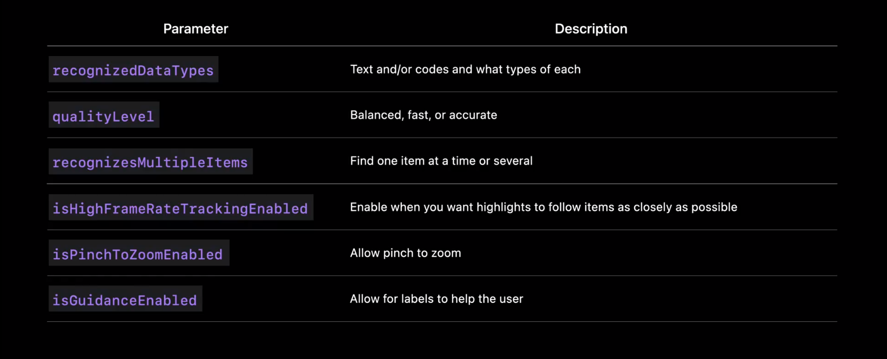
 
  #### Privacy usage description
  - 카메라 권한 필요
  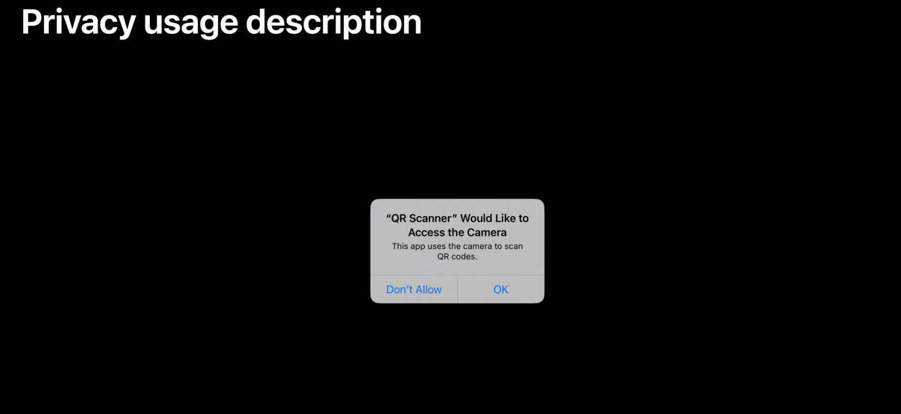
  
  #### Draw custom highlight

- delegate 사용을 통해 machine-redable code객체의 정보 (아이디, 좌표, 내용 등등) 전달받음
  - UniqueID, Bounds(four corners)

- delegate 지정
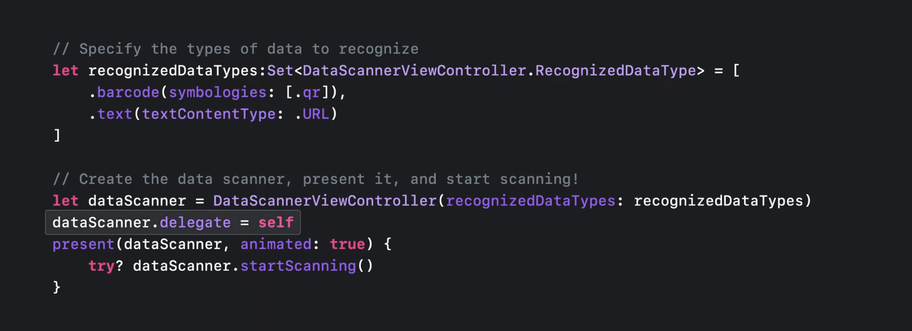

- didAdd
    - item이 새로 인식된 경우
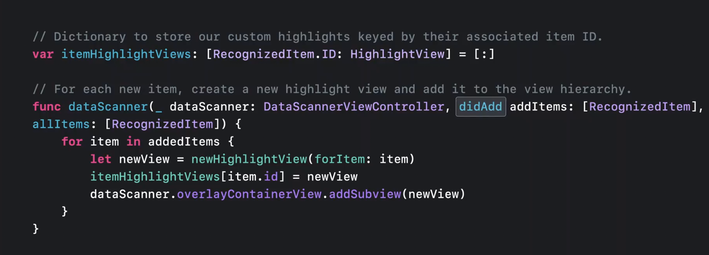

- didUpdate 
    - item이 이동하거나 카메라가 이동하는 경우
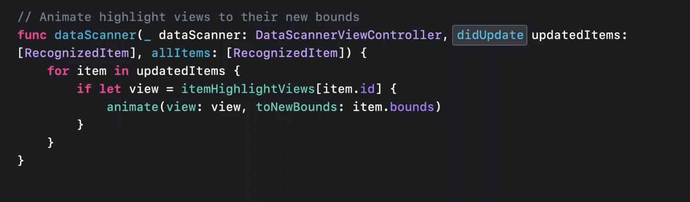
 
 - didRemove
    - item이 제거된 경우 (화면에서 더이상 보이지 않는 경우)
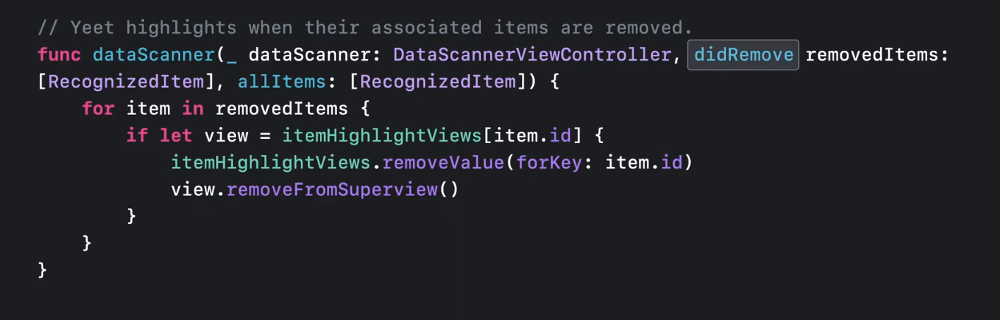
   
