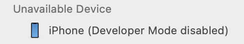
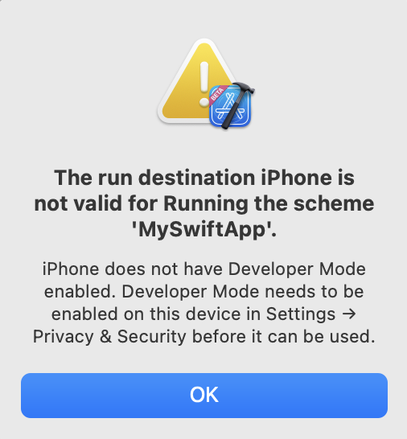
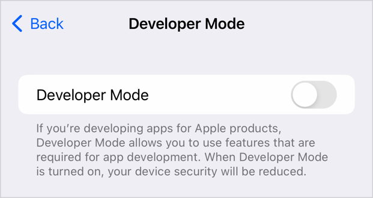
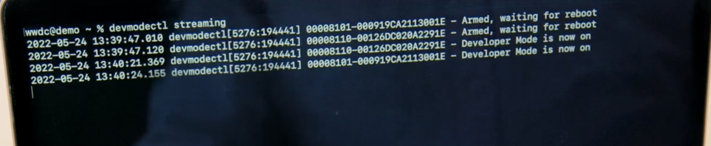

# Get to know developer mode

### What is Developer Mode
- iOS16 & watchOS9 부터 등장한 mode
- Default동작은 disable & 기기를 개발자 모드에 등록 필수 : 대부분 개발자가 아니며 강력한 개발자용 기능이 보안에 위협일 수 있음
- 대부분의 경우 Developer Mode가 필요하진 않지만 개발자가 실제 개발 기기에 개발중일때 필수
  - AppStore, TestFlight, Enterprise distribution 에는 영향없음

### Using Developer Mode
- Development mode를 on
- Developer mode가 off라면 Build & Run 불가

- Settings > Privacy & Security

### Automation flows

- 모든 기기를 Developer mode를 on하기 힘드니 자동화 기능을 제공 (macOS Ventura)
  - 단, passcode가 설정되지 않은 device 한정
  - 단일 기계 혹은 연결된 모든 기계 가능 (streaming - 옵션)

