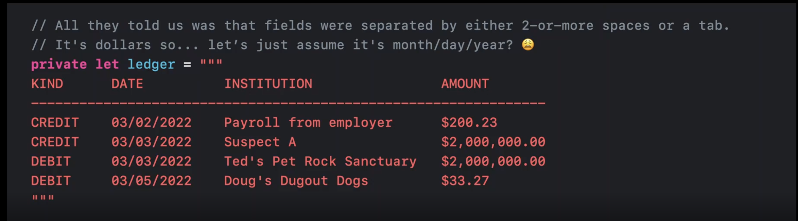
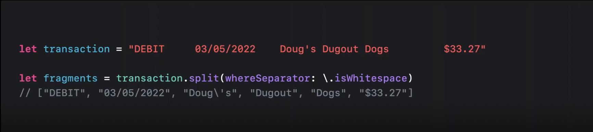
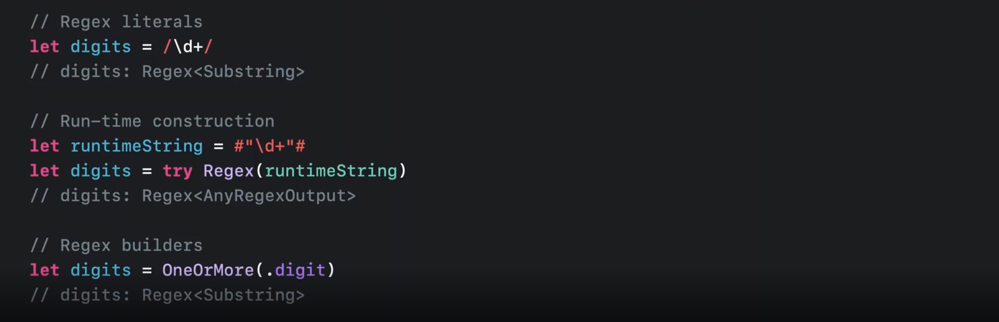
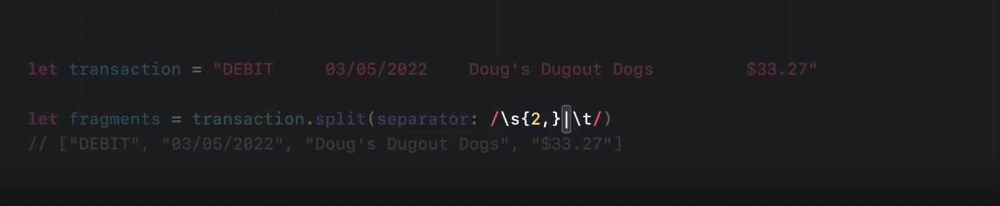
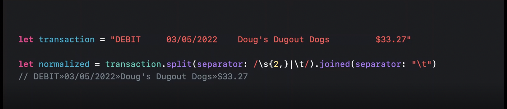

# Meet swift regex

### Regular expression은 왜 유용한가?
- 복잡한 패턴에서 원하는 결과물을 얻기 위한 경우 사용하면 좋음
- 복잡한 데이터 (text)

- 어려운길..

<image

### Regex
- swift의 Regex는 Perl, Python, Rucy, Java, NSRegularExpressions등 수많은 언어들과 호환
- Regex는 runtime에도 만들수 있음 (String 데이터로 전달 받을수 있음)
  - 다만 runtime의 경우 generic의 output 타입은 'AnyRegexOutput'
  - 런타임에 결과물의 유형과 타입을 알수가 업기 때문
- Regex Builder 사용해서도 생성 가능

- 문자열을 2개 이상의 공백 혹은 탭으로 구분

- 구분(2개 이상의 공백 or tab)후 normalize

