# Meet swift regex

### Regular expression은 왜 유용한가?
- 복잡한 패턴에서 원하는 결과물을 얻기 위한 경우 사용하면 좋음
- 복잡한 데이터 (text)

- 어려운길..

### Swift Regex

- swift의 Regex는 Perl, Python, Rucy, Java, NSRegularExpressions등 수많은 언어들과 호환
- Regex는 runtime에도 만들수 있음 (String 데이터로 전달 받을수 있음)
  - 다만 runtime의 경우 generic의 output 타입은 'AnyRegexOutput'
  - 런타임에 결과물의 유형과 타입을 알수가 업기 때문
- Regex Builder 사용해서도 생성 가능

- 문자열을 2개 이상의 공백 혹은 탭으로 구분

- 구분(2개 이상의 공백 or tab)후 normalize

- Regular expression 단점
  - 문법이 간결하고 표현적이지만 읽기가 힘들다 (가독성 낮음)
  - 새로운 기능이 추가될때마다 더욱? 일기가 어려워진다

- Swift Regex
  - 소스코드와 동일한 방식으로 구조화되고 정리될 수 있음
  - 데이터의 복잡성 (복잡한 패턴의 텍스트)이 증가될수록 표준을 지키는 Parser가 필요
    - 그게바로 Swift Regex (;;)
  - Unicode 사용
  - Predictable execution & Surfaces controls
    - 리터럴 표현을 통해 형추론이 가능한 부분을 얘기하는듯? 

- Swift Regex 실전 (은행 거래장부 인식)
  - import RegexBuidler 선언
  - 불필요한 process

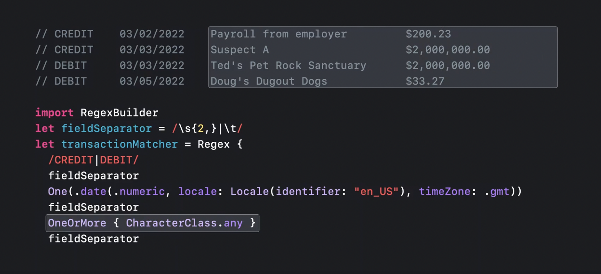

    - 매칭되는 전체 문자열을 저장한 후 뒤 패턴 적용해서 잘라내는 방식

  - 최적화

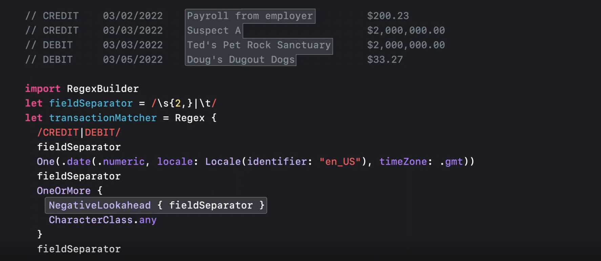

    - NagativeLookhead 사용하면 최적화 가능
    - 전체 내용을 백업하지 않고 미리 뒤의 패턴을 만나면 멈추는 keyword
    
  - 마지막

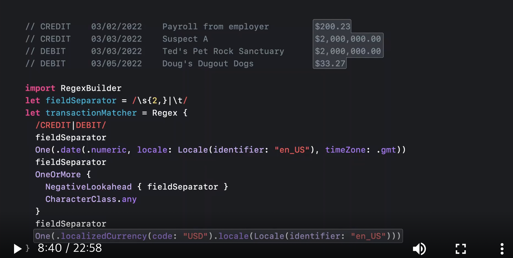

- Swift Regex 실전 (Capture - 추출)
  - Capture를 통해 Regex의 generic 타입이 결정
  - 날짜의 경우 텍스트를 날짜타입으로 변환할 필요없이 바로 실제 타입 (날짜)으로 변환됨
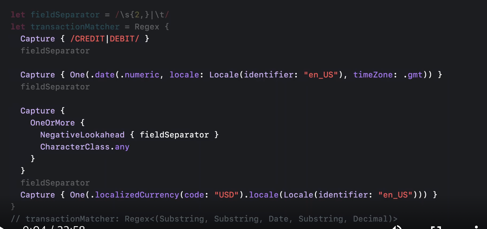

  - 인식된 값중 Date와 Decimal 을 추출
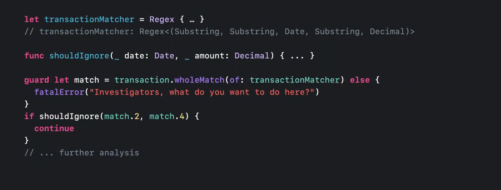

  - 추출된 값이 모호한 경우
    - 화폐단위가 다르거나 국가별로 transaction의 날짜가 상이한 경우 (미국 달러 : 월/일/년, 영국 파운드: 일/월/년)
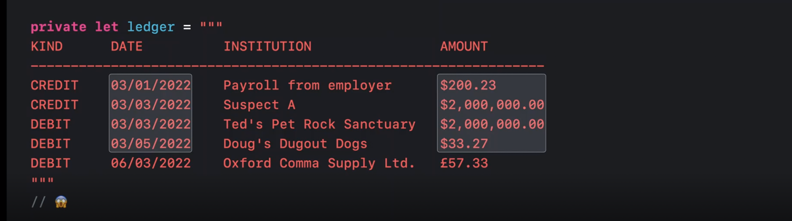

  - SubString 제어 (유니코드 사용)
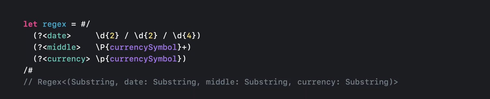

    - date, middle, currency처럼 "named capture" 가능
    - /P{currencySymbol)+ : 통화기호가 나오지 않는 모든 문자와 매치
    - /p{currencySymbol} : 통화기호가 하나 나오는 문자열

  - ParseStrategy 사용
    - 미국 / 영국 transaction의 경우처럼 월/일/연도가 다른 경우 스트링을 직접 잘라서 조건으로 나누지 말고 Strategy 사용 가능
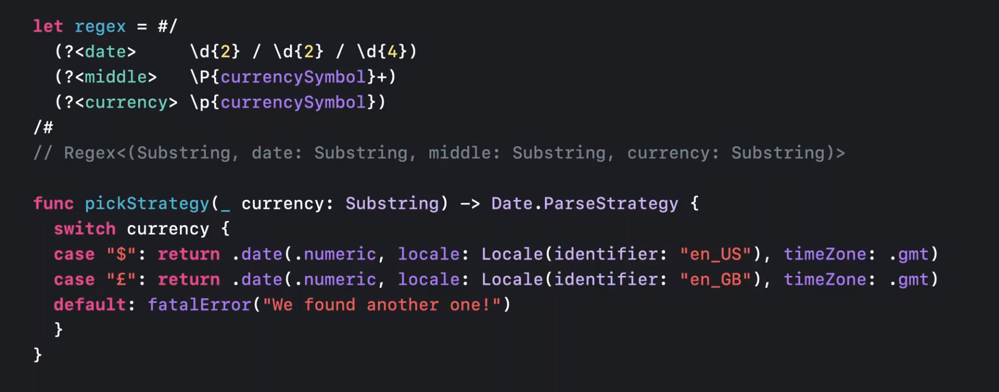

    - Strategy 사용
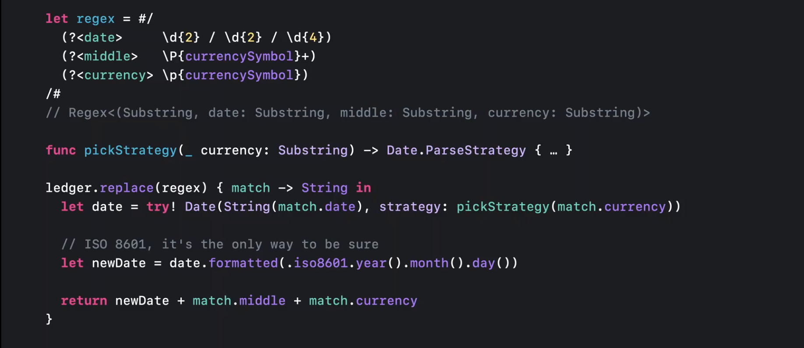

    - Date 스트링 normalize

  - Unicode extended grapheme clusters
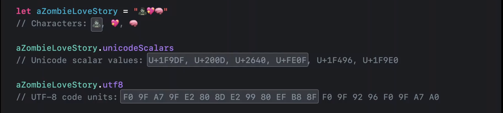
    
    - 단일 이모지가 여러개의 unicode scalar value로 이루어져 있음
    - String은 UnicodeScalrView 제공 -> 다른 시스템과의 호환 및 고급 사용 가능 (?)
    - String일 일단 메모리에 올라가면, UTF8 코드로 인코딩되고 UTF8View로 확인 가능
    
  - 동일한 문자를 다른 Scalar 집합으로 표현
    - 영어외의 언어에서 보임
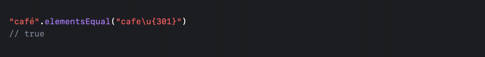

  - 그러나 ScalarView, UTF8View 관점에서는 다름
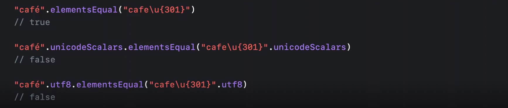

  - 일반적으로는 Unicode가 정확
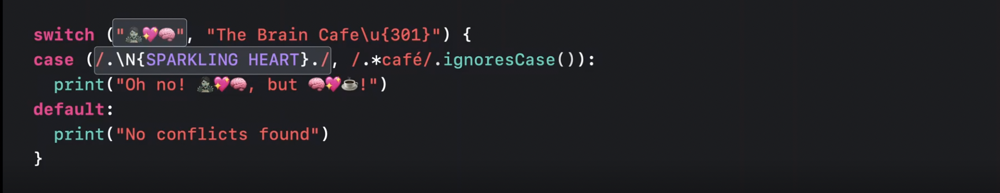

    - . : 모든문자와 일치 (unicode 확장 그래픽 클러스터와 일치)
    
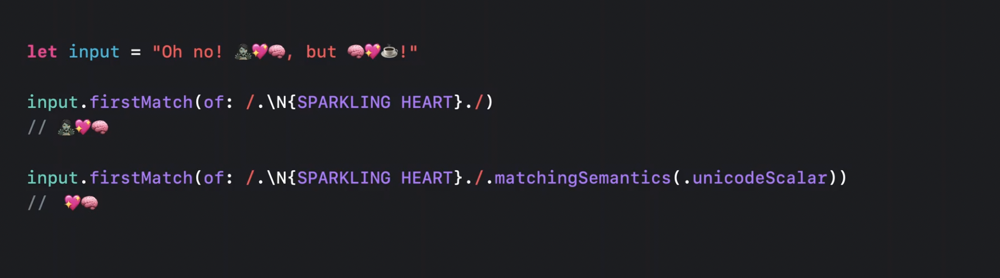

    - .machingSemantics를 unicodeScalar로 지정한 경우 첫번째 이모지는 멀티 유니코드기때문에 매칭되지 않음

  - 실시간 처리 상황을 대입 (위의 상황과 약간 다른점) : scale성 확보를 위한 예제
    - 데이트가 아닌 timestamp로 처리도 있음
    - Timestamp와 detail 필드가 간혹 더 복잡한 경우가 있음
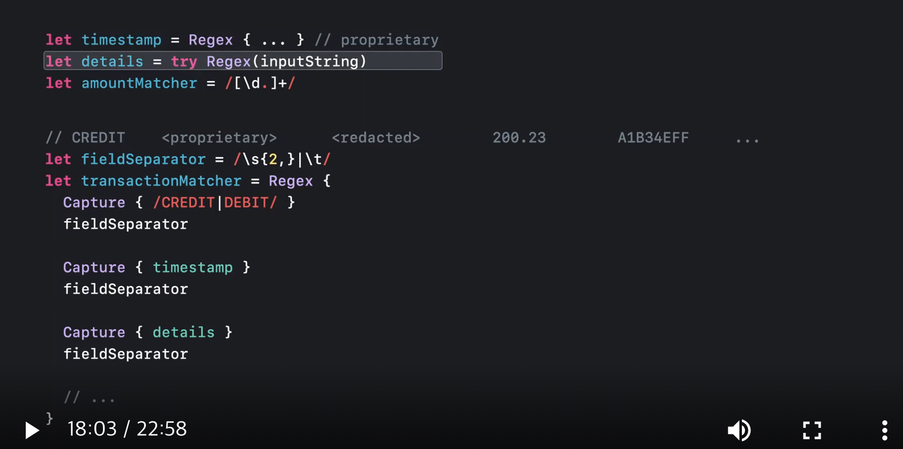

    - regex가 필드별로만 적용되도록 negative lookahead 적용
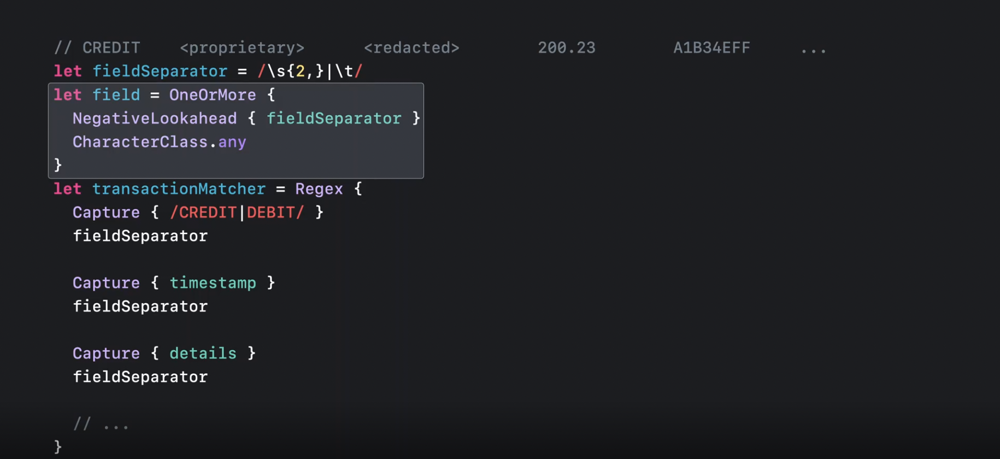

    - TryCapture 사용
    - 미리 만든 matched feild를 전달하여 closure에서 regex 사용
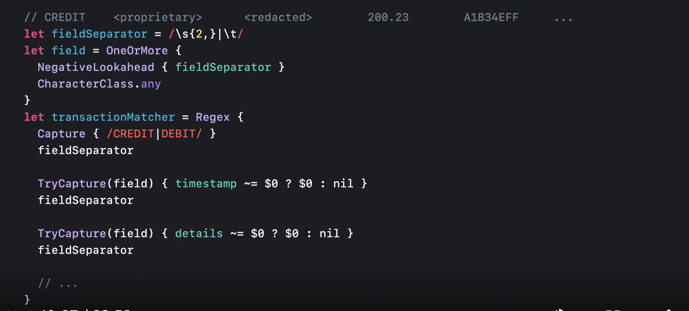

    - Kleene closure 이슈 (오토마타 이론)
    - 실시간에서는 부적함 : 뒤의 regex가 매칭에 실패사면 backtracking을 통해 반복작업을 수행 (속도 메모리 이슈)
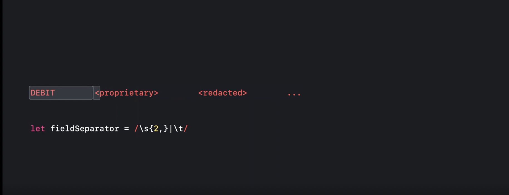

    - Local 키워드로 극복
    - match된 이후의 regex에서 실패하더라도 뒤로 돌아가지 않음 (Global backtracking 진행 X)
    - 양날의 검 잘써야함!
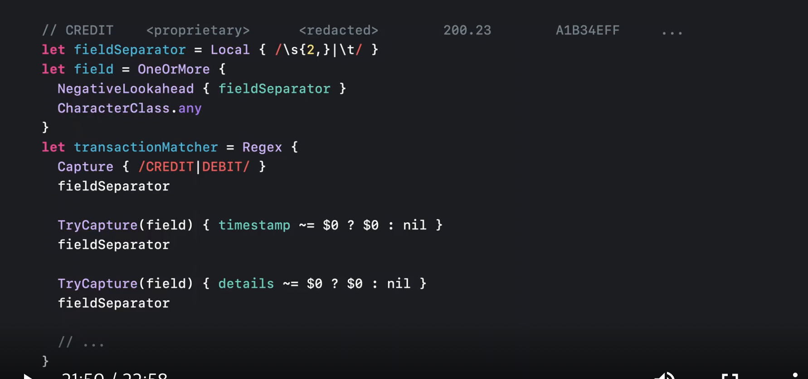

- 참고 코드
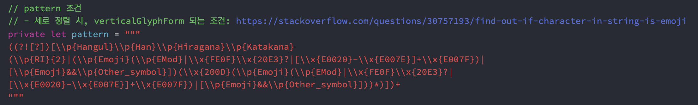

 
