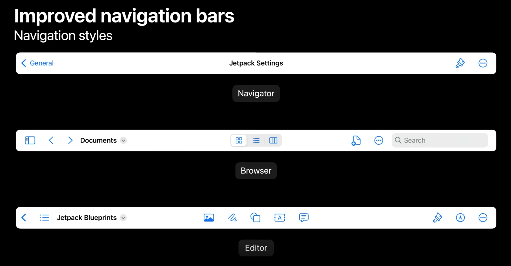
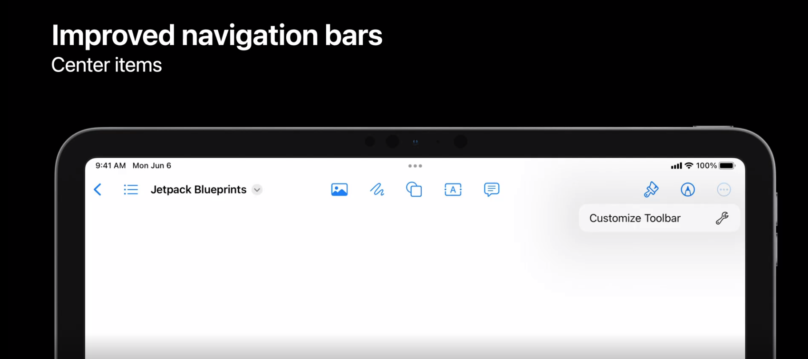
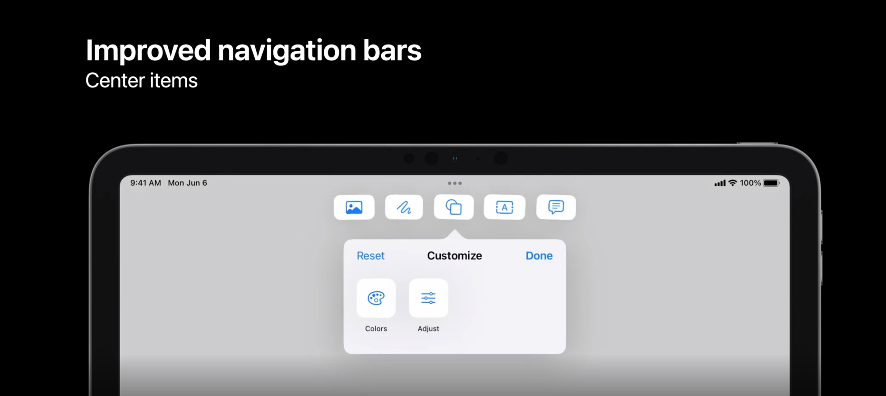
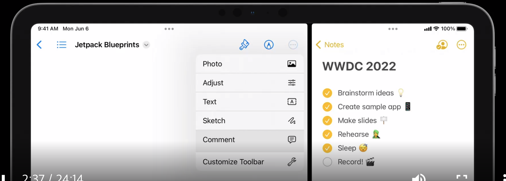
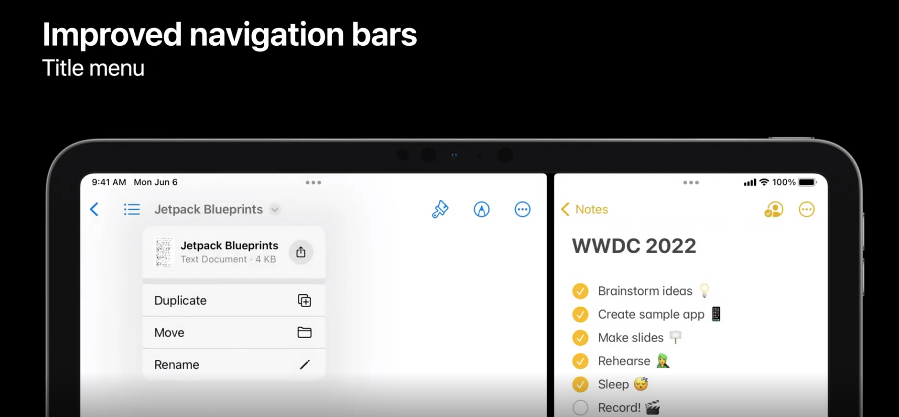
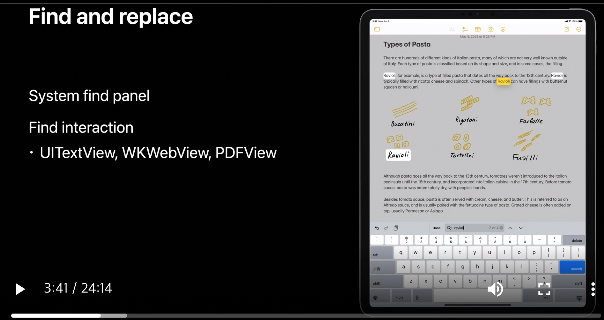
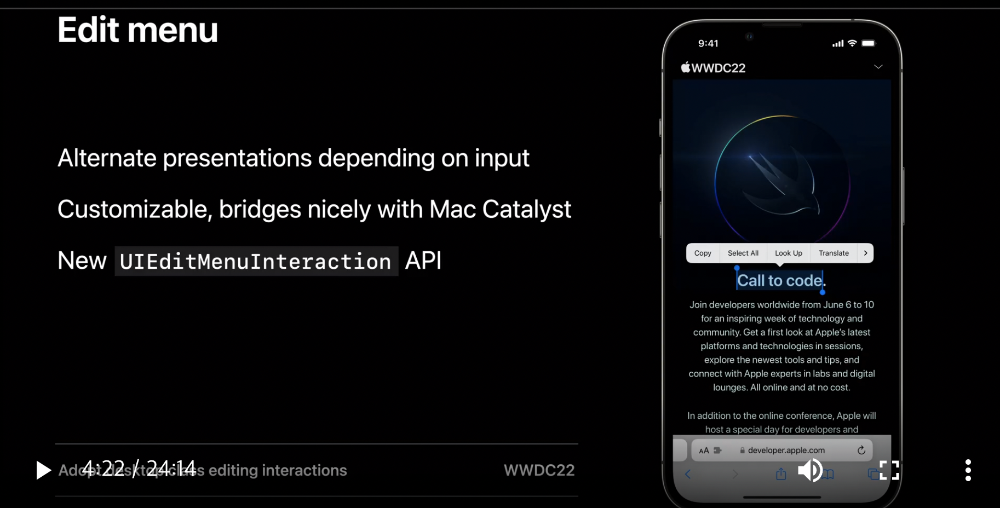
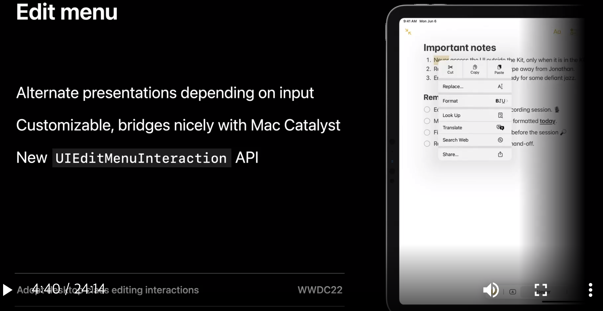
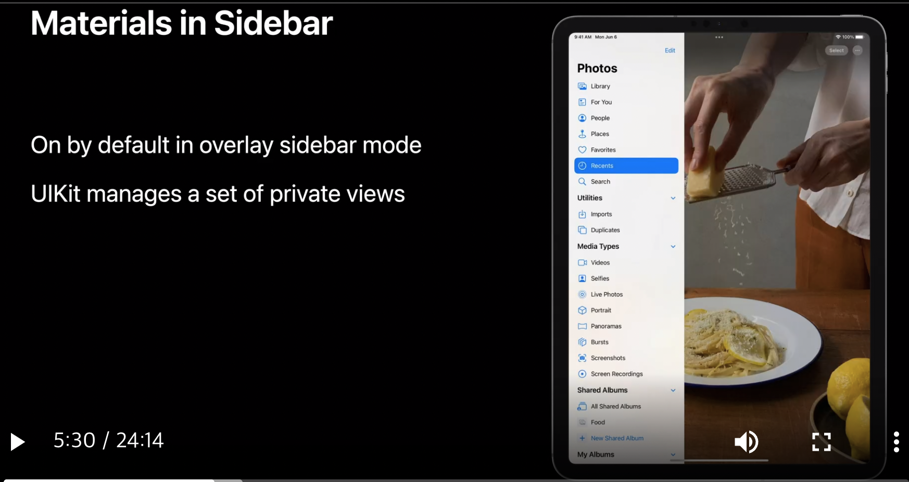

# Productivity improvements

#### Improved navigation bars

* 새로운 navigation bar 제공
  * Document based app: broaser and editor
  * 다양한 버튼 추가 가능

* Customize toolbar
  * 앱이 실행되는 동안 변경사항 유지

* side-by-side 모드와 같이 화면 표시가 부족하게 되는 경우에는 overflow 메뉴 제공 (auto)

#### Title menu

* 새로운 navigation bar와 같이 사용하는 title menu 
  * 기본 기능 제공 (duplicate, move, rename, export, print)
  * delegate 구현을 통해 가능
  * Mac Catalyst로 빌드한 앱은 추가코드 없이 NSToolbar와 완벽히 통합되어 향상된 기능 제공

#### Find and replace

* 다양한 app에서 텍스트를 일관되게 조작하는 방법 (iOS 16)
   * 이전 in-app search 보다 high level 이라는데... 추상적인 설명이라 어디까지 가능할지 디테일하게는 알기 어려웠음
   * 설명으로는 범위가 여러 뷰와 문서들에 걸쳐 작용가능한듯

#### Edit menu

* input method (터치등?)에 다르게 UI 구성 가능
  * 자세한 내용은 "Adopt desktop calss editing interactions" 참고

* input method (터치등?)에 다르게 UI 구성 가능

#### Sidebar

* Visual UI update
  * iOS 16에서는 silder over mode에서 자동 제공 (코드 추가 없이)
  

